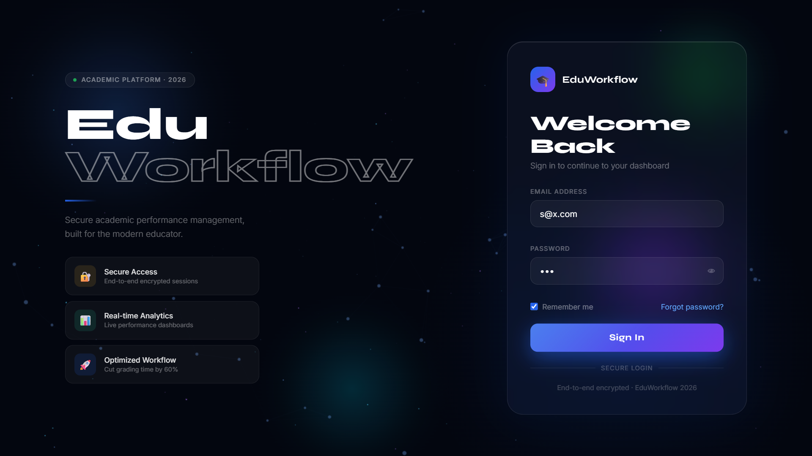
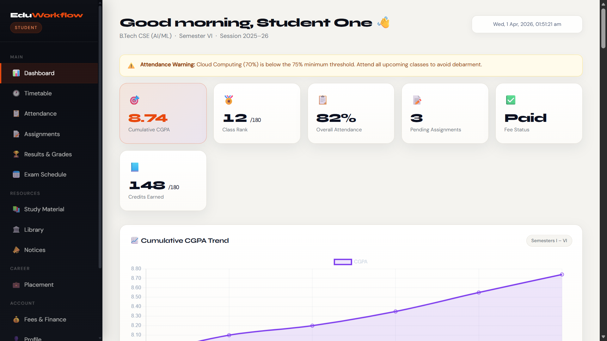
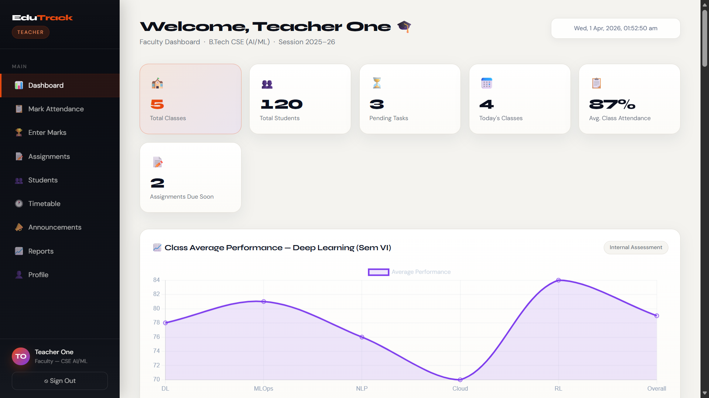
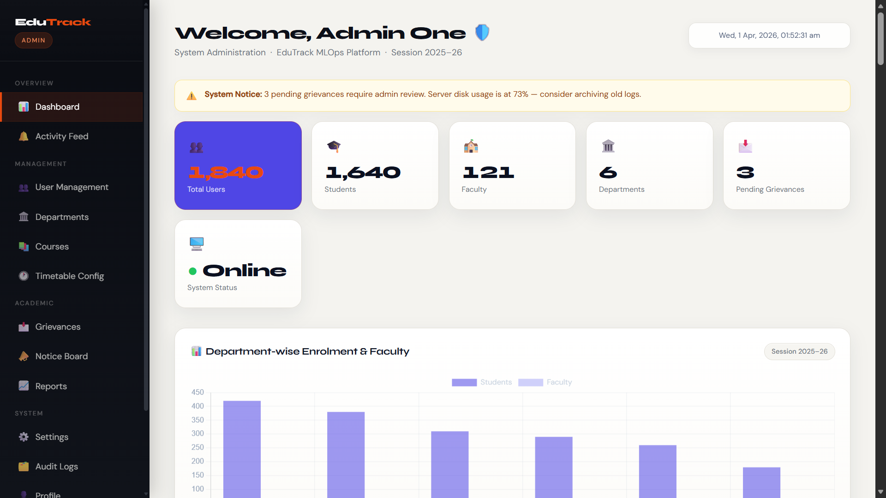

# 🚀 Edu-Workflow

### Automated Workflow & Performance Monitoring Platform for Academic Institutions

  
  
  
  

---

## ✨ What is Edu-Workflow?

Edu-Workflow is a **full-stack academic management platform** designed to automate institutional workflows and provide real-time performance monitoring.

Instead of juggling multiple disconnected systems, it brings everything — **students, teachers, and administrators** — into one structured and efficient ecosystem.

> Built with a focus on **real-world usability, system design, and clean UI/UX** for institutions.

---

## 🧠 Problem It Solves

Academic institutions commonly suffer from:

- Fragmented systems across departments  
- Manual approval workflows  
- Delayed communication  
- Lack of real-time performance visibility  

These issues slow down operations and reduce transparency.

**Edu-Workflow solves this by:**
- Centralizing workflows  
- Automating processes  
- Providing real-time dashboards  
- Enabling role-based control  

---

## 🔥 Core Features

### 🔐 Role-Based System
- Separate dashboards for:
  - Students  
  - Teachers  
  - Admins  
- Controlled access permissions  
- Session-based UI protection  

---

### 📊 Smart Dashboards
- Real-time personalized dashboards  
- Integrated charts (Chart.js)  
- Academic performance tracking  
- Live system clock  

---

### 🧑‍🎓 Student Capabilities
- View attendance and marks  
- Apply for placements  
- Pay fees (dynamic simulation)  
- Submit grievances  
- Track assignments  

---

### 👨‍🏫 Teacher Tools
- Upload assignments  
- Manage submissions  
- Record attendance  
- Enter marks  
- Post announcements  

---

### 🛠️ Admin Control Panel
- Manage users & roles  
- Publish notices  
- Monitor institutional data  
- Access analytics  

---

### ⚡ Advanced UI / UX
- Animated login (canvas-based background)  
- Toast notification system  
- Dynamic modals (no page reloads)  
- Avatar generation  
- Smooth transitions and responsive layout  

---

### 🔄 Workflow Automation
- Assignment lifecycle handling  
- Fee payment updates  
- Placement application flow  
- Instant form feedback  

---

### 🔎 Search & Filtering
- Student filtering (teacher dashboard)  
- Admin filtering by role  
- Dynamic table updates  

---

## 🧱 Tech Stack

### Frontend
- HTML5  
- CSS3 (custom styling, responsive design)  
- JavaScript (Vanilla JS)  
- Chart.js  

### Backend
- Flask (Python)  
- REST API  
- JSON-based communication  

---

## 🏗️ Project Architecture

~~~
Frontend (UI)
│
├── Login System
├── Role-Based Dashboards
├── Dynamic Components (modals, tables, charts)
│
Backend (Flask API)
│
├── Authentication
├── Role Handling
├── Data Processing
│
Storage
│
├── LocalStorage (session)
├── API-driven data
~~~

---

## 📸 Screenshots

---

## ⚙️ Setup & Run

### Backend
~~~
cd backend
pip install -r requirements.txt
python app.py
~~~

### Frontend
Open:

~~~
index.html
~~~

Make sure backend runs on:

~~~
http://127.0.0.1:5000
~~~

---

## 🚀 Roadmap

- JWT authentication (replace localStorage)  
- Database integration (PostgreSQL / MongoDB)  
- Notification system (email + in-app)  
- Multi-institution scalability  
- AI-based analytics insights  
- Dark mode  
- Mobile optimization  

---

## 💡 Why This Project Stands Out

- Clean, structured architecture  
- Real institutional workflow modeling  
- Fully interactive dashboards  
- Not template-based — built from scratch  
- Focused on real usability, not just UI  

---

## 👥 Team — Smashers

- **Yash Kaushik** — Team Leader  
- Shivam Kumar Gupta  
- Aditya Yadav  
- Aaditya Kumar  
- Yuvraj Singh Soni  
- Pranav Dhiman  

---

## 📄 License

This project is licensed under the MIT License.

---

## 🧩 Final Note

Edu-Workflow is not just a prototype — it’s a practical system built to solve real academic workflow challenges using modern web technologies.